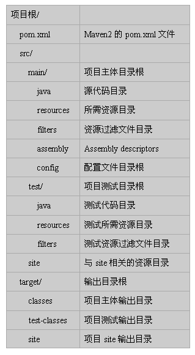

% 代码构建
% 王一帆
% 江苏企业大学

## 回忆我们如何获取MySQL驱动

- 到网上搜索MySQL的jdbc驱动
- 下载到本地,并拷贝的项目的lib目录下
- 设置此jar到classpath中

## 存在的问题

- 操作繁琐
- 无版本管理.可能出现版本冲突
- 项目体积过大

- 项目结构依赖eclipse,不方便切换到其它开发工具

## 解决方案

- Maven
    + 项目构建
    + 文档管理
    + 生成测试报告
    + 解决项目间依赖项
    + 源代码版本管理
    + 项目Releases
    + 项目的分发

## Maven名词解释

- Project
    任何你想 build 的事物，Maven都会把它们当作是一个 Project。
    这些 Project 被定义为 POM(Project Object Model)。
    一个 Project 可以依赖其他的project，一个 project 也可以有多个子project组成。
- POM
    POM(pom.xml) 是 Maven 的核心文件，它是指示 Maven 如何工作的元数据文件，类似 ant 的 build.xml 文件。
    pom.xml 文件应该位于每个 Project 的根目录。
- GroupId
    顾名思义，这个应该是公司名或组织名。
- ArtifactId
    构建出来的文件名，一般来说或，这个也是project名。
- Packaging
    项目打包的类型，可以是将jar、war、rar、ear、pom，默认是jar。
- Version
    项目的版本，项目的唯一标识由 groupId+artifactId+packaging+versionz 组成。
- Dependency
    为了能够 build 或运行，一个典型的java project会依赖其他的包，在Maven中，这些被依赖的包就被称为 dependency。
- Plug-in
    Maven是有插件组织的，它的每一个功能都是由插件提供的，主要的插件是由 java 来写的，但是他也支持 beanshell 和 ant 脚本编写的插件。
- Repository
    仓库用来存放artifact的，可以是本地仓库，也可以是远程仓库，Maven是由一个默认的仓库
- Snapshot
    工程中可以（也应该）有这样一个特殊的版本：这个版本可以告诉Maven，该工程正在处于开发阶段，会经常更新（但还为发布）。当其他工程依赖此类型的artifact时，Maven会在仓库中寻找该artifact的最新版本，并自动下载、使用该最新版本。

## Maven命令

- mvn archetype:create 	创建Maven项目
- mvn compile 	编译源代码
- mvn test 	运行应用程序中的单元测试
- mvn install 	在本地Respository中安装jar
- mvn eclipse:eclipse 	生成eclipse项目文件
- mvn jetty:run 	启动jetty服务
- mvn clean 	清除项目目录中的生成结果
- mvn site 	生成项目相关信息的网站
- mvn package 	根据项目生成的jar

## Maven生命周期

- validate 	验证 	确保当前配置和 POM 的内容是有效的。这包含对 pom.xml 文件树的验证。
- initialize 	初始化 	在执行构建生命周期的主任务之前可以进行初始化。
- generate-sources 	生成源码 	代码生成器可以开始生成在以后阶段中处理或编译的源代码。
- process-sources 	处理源码 	提供解析、修改和转换源码。常规源码和生成的源码都可以在这里处理。
- generate-resources 	生成资源 	可以生成非源码资源。通常包括元数据文件和配置文件。
- process-resources 	处理资源 	处理非源码资源。修改、转换和重定位资源都能在这阶段发生。
- compile 	编译 	编译源码。编译过的类被放到目标目录树中。
- process-classes 	处理类 	处理类文件转换和增强步骤。字节码交织器和常用工具常在这一阶段操作。
- generate-test-sources 	生成测试源码 	mojo 可以生成要操作的单元测试代码。
- process-test-sources 	处理测试源码 	在编译前对测试源码执行任何必要的处理。在这一阶段，可以修改、转换或复制源代码。
- generate-test-resources 	生成测试资源 	允许生成与测试相关的（非源码）资源。
- process-test-resources 	处理测试资源 	可以处理、转换和重新定位与测试相关的资源。
- test-compile 	测试编译 	编译单元测试的源码。
- process-test-classes 	对测试编译生成的文件做后期处理(需Maven2.0.5及以上)
- test 	测试 	运行编译过的单元测试并累计结果。
- prepare-package 	执行打包前的所有操作(需Maven2.1及以上)
- package 	打包 	将可执行的二进制文件打包到一个分布式归档文件中，如 JAR 或 WAR。
- pre-integration-test 	前集成测试 	准备集成测试。这种情况下的集成测试是指在一个受到一定控制的模拟的真实部署环境中测试代码。这一步能将归档文件部署到一个服务器上执行。
- integration-test 	集成测试 	执行真正的集成测试。
- post-integration-test 	后集成测试 	解除集成测试准备。这一步涉及测试环境重置或重新初始化。
- verify 	检验 	检验可部署归档的有效性和完整性。过了这个阶段，将安装该归档。
- install 	安装 	将该归档添加到本地 Maven 目录。这一步让其他可能依赖该归档的模块可以使用它。
- deploy 	部署 	将该归档添加到远程 Maven 目录。这一步让这个工件能为更多的人所用。

## Maven的安装

- 请自行到[](http://maven.apache.org/download.cgi)下载最新版Maven
- 解压,设置path即可

## 创建项目

```
mvn archetype:create
-DgroupId=com.mycompany.app
-DartifactId=my-webapp
-DarchetypeArtifactId=maven-archetype-webapp
```

## 目录结构




## 课堂练习

- 安装Maven
- 使用Maven创建项目

## eclipse与Maven

- eclipse提供maven的集成
- http://mvnrepository.com/

## 新建Maven项目一


## 新建Maven项目二


## 新建Maven项目三


## 新建Maven项目四


## 课堂练习

- 使用eclipse创建Maven项目


## 课后作业

- 将博客程序修改为maven项目


